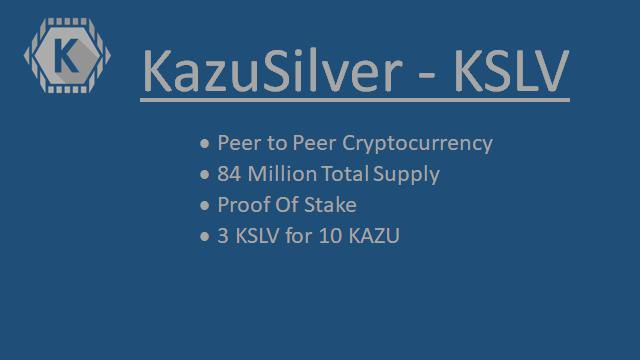

This is the working repository for KazuSilver 1.0.1,  a fork of NavCoin 4.4.0 (which is a fork of bitcoin-core 0.13 🙂)

For more information please visit the website:

https://www.kazucoin.io

## Coin Specifications

| Specification | Value |
|:-----------|:-----------|
| Block Spacing | `30 seconds` |
| Stake Minimum Age | `2 hours` |
| Stake Reward First Year| `9% per month` |
| Stake Reward Second Year| `7% per month` |
| Stake Reward 3+ Years| `5% per month` |
| Port | `33445` |
| RPC Port | `23443` |

## Kazutech Settings (Anonymous Transactions)

| Specification | Value |
|:-----------|:-----------|
| addanonserver | `xxx` |

(* Not Yet Available)

## Social Channels

| Site | link |
|:-----------|:-----------|
| Medium | https://medium.com/@kazucoin |
| Twitter | https://twitter.com/Kazucoin1 |
| Telegram | https://t.me/Kazugeneralchitchat |

License
---------------------
Distributed under the [MIT software license](http://www.opensource.org/licenses/mit-license.php).
